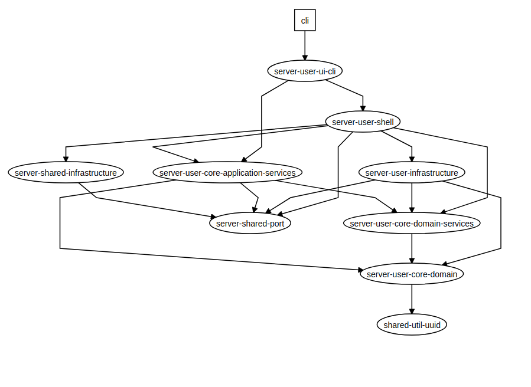

### If you are looking for an example of a real application that follows the rules described in [my article](https://medium.com/@maciejsikorski/onion-architecture-with-nest-js-and-nx-d9b5c7126b37) check out the [Pimp My Pr](https://github.com/valueadd-poland/pimp-my-pr)
# ToDo App

This project was generated using [Nx](https://nx.dev).

🔎 **Nx is a set of Extensible Dev Tools for Monorepos.**

## Project description

#### Main domain: Eisenhower Matrix

A set of tasks that should be handled in a specific way.

### The second one: Users

A group of users that can be created and each one has its own matrix that can maintain.

## Comments

During the development of that project I had a vision of it described above,
but the main reason for building this repo was to provide an example of the Nest.js, Nx and Onion Architecture.
So you probably won't find here a full-featured project, especially on the fronted side which is skipped for now.

I encourage you to focus on the workflow of each feature/use case from the application through the ui, shell, application services and domain.
Also on the composition of the application by ports and adapters.

## Independence of framework

You can see a lot of duplicated classes from application-services layer inside the shell libraries like AddTaskHandlerImpl.
It is an example of the implementation of the independence of framework.

In many projects, it is an over-engineering and the application-service layer could have its own module to provide the facade, CQRS handlers and other services. It will make shell modules much simpler.
You could also use @CommandHandler and other decorators from @nestjs.

## Sample dependency graph

## Setup

Run `npm install` to install project dependencies

## Development

Run `ng serve` to run web application in development mode.

Run `ng serve api` to run api in development mode.

Run `ng serve cli` to recompile cli application on each change
and run `CLI_PATH=./dist/apps/cli/main.js npx nestjs-command user:create Maciek` to execute sample cli command.
